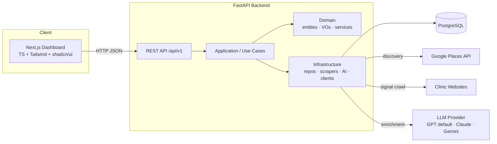
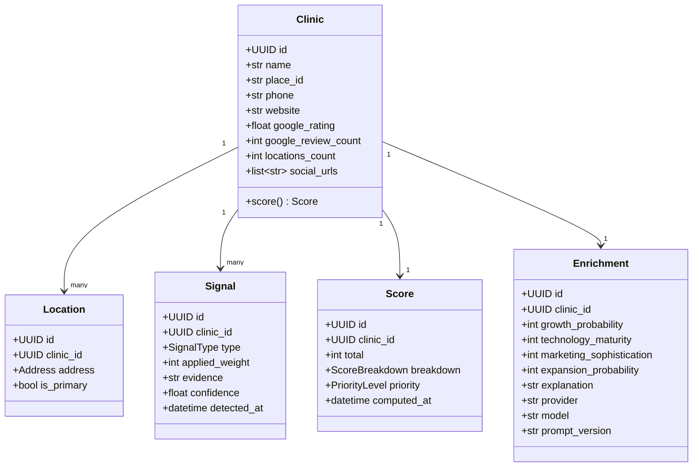
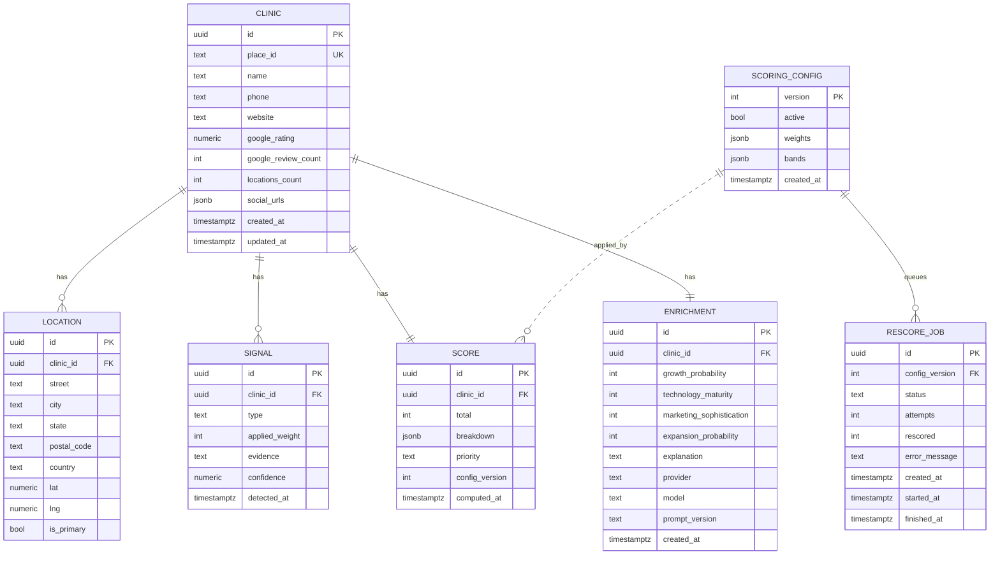
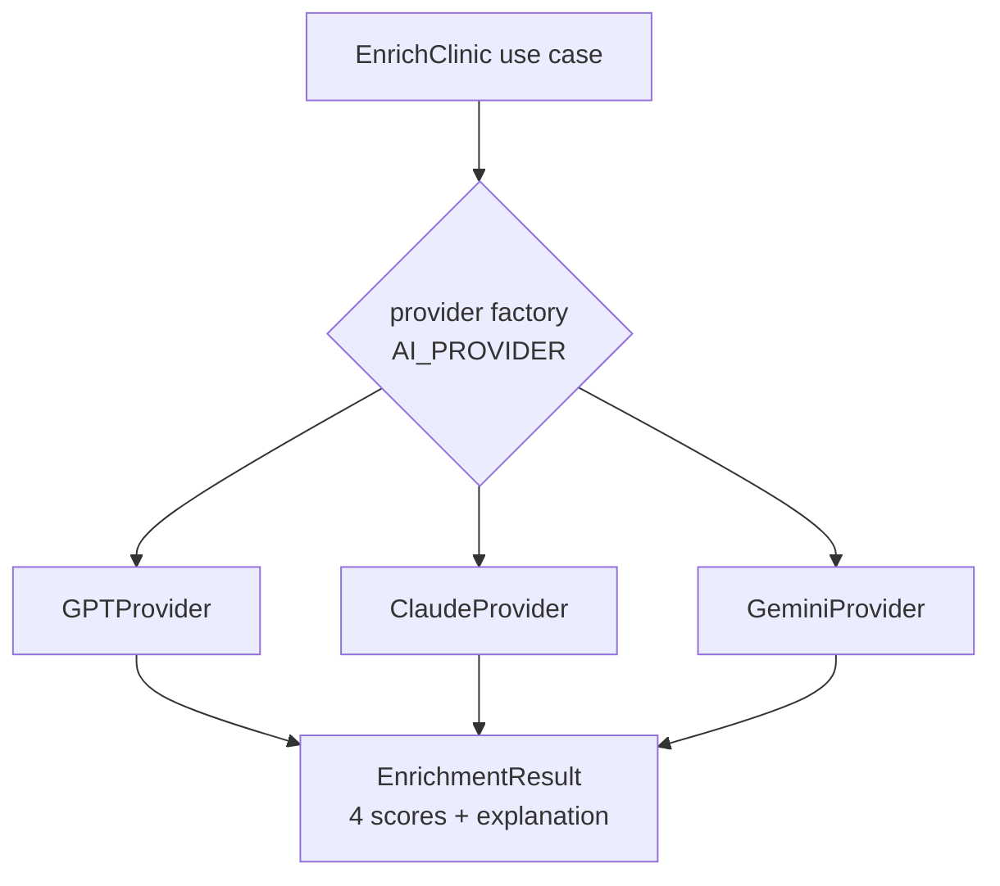

# Dental Radar — System Architecture & Design

> Deliverables 2 (Architecture), 3 (Domain Model), 4 (Database Schema), 5 (API Design), 6 (Folder Structure).
> See [product.md](./product.md) for requirements, [roadmap.md](../internal/roadmap.md) for phasing.

---

## 1. System architecture (Deliverable 2)



**Style:** Clean Architecture + DDD-Lite + SOLID. The stack has a FastAPI API, a dedicated rescore worker using a durable Postgres job table, a Next.js app, Postgres, and Redis. Batch ingestion remains available through CLI commands; scoring-config rescores are queued and processed outside the request path.

### Dependency rule
Dependencies point inward only: `Presentation → Application → Domain`; `Infrastructure → (implements) → Application/Domain ports`. Domain imports nothing from outer layers.

### Layer responsibilities

| Layer | Contains | Knows about |
|-------|----------|-------------|
| **Domain** | Entities, Value Objects, domain services (scoring, signal rules), repository **interfaces** (ports) | nothing outer |
| **Application** | Use cases (orchestration), DTOs, provider **interfaces** (`ClinicSource`, `LLMProvider`) | Domain |
| **Infrastructure** | SQLAlchemy repos, Alembic, Google Places client, website crawler, LLM providers | Application + Domain (implements ports) |
| **Presentation** | FastAPI routers, request/response schemas, dependency wiring | Application |

### Pipeline (batch)
```
discover (Google Places) → persist clinics
        → detect signals (crawl site) → persist signals
        → score (config weights) → persist score + band
        → enrich (LLM) → persist enrichment
        → dashboard reads ranked data
```

---

## 2. Domain model (Deliverable 3)



### Entities
`Clinic` (aggregate root), `Location`, `Signal`, `Score`, `Enrichment`, `ScoringConfig`, `RescoreJob`.

### Value Objects (immutable, no identity)
- `Address` — street, city, state, postal_code, country, lat, lng.
- `SignalType` — enum: `HIRING`, `ADVERTISING`, `WEBSITE_QUALITY`, `MULTI_LOCATION`, `HIGH_TICKET`.
- `SignalWeight` — int weight with validation (≥0).
- `ScoreBreakdown` — map of `SignalType → contributed points`, sums to `total`.
- `PriorityLevel` — enum: `COLD`, `WARM`, `HOT`, `IMMEDIATE`, derived from total + band config.

### Domain services
- `SignalDetectionService` — pure rules turning crawl evidence into `Signal`s (the *what counts* logic; the *how to fetch* lives in infra crawler).
- `ScoringService` — sums signal weights using a `ScoringConfig`, builds `ScoreBreakdown`, maps to `PriorityLevel`. No I/O.

### Ports (interfaces)
- `ClinicRepository`, `SignalRepository`, `ScoreRepository`, `EnrichmentRepository` (Domain).
- `ClinicSource.search(query) -> list[ClinicData]` (Application) — Google Places impl in infra.
- `WebsiteCrawler.fetch(url) -> PageEvidence` (Application).
- `LLMProvider.analyze_clinic(payload) -> EnrichmentResult` (Application).

---

## 3. Scoring engine & configuration

`ScoringConfig` holds signal weights + band thresholds, persisted in table `scoring_config` (one active row, versioned). Seeded from defaults:

```json
{
  "version": 1,
  "active": true,
  "weights": {
    "HIRING": 25,
    "ADVERTISING": 30,
    "WEBSITE_QUALITY": 15,
    "MULTI_LOCATION": 40,
    "HIGH_TICKET": 20
  },
  "bands": [
    {"name": "COLD",      "min": 0,   "max": 50},
    {"name": "WARM",      "min": 51,  "max": 100},
    {"name": "HOT",       "min": 101, "max": 150},
    {"name": "IMMEDIATE", "min": 151, "max": null}
  ]
}
```

`ScoringService.compute(signals, config)` → `Score`. Editing the active config via API (`PUT /api/v1/scoring-config`) and requesting `rescore=true` atomically creates a durable job. The worker processes jobs in version order and updates every score in one transaction — **no redeploy, no code change**. Optionally a YAML default seed (`infrastructure/config/scoring_defaults.yaml`) bootstraps the first row.

---

## 4. Database schema (Deliverable 4)

### 4.1 ERD



### 4.2 Tables & relationships
- `clinic` 1—N `location`; 1—N `signal`; 1—1 `score`; 1—1 `enrichment`.
- `scoring_config` versioned; `score.config_version` references the config used.
- `rescore_job` stores durable, retryable work for a specific scoring-config version.

### 4.3 DDL sketch (Postgres)

```sql
CREATE TABLE clinic (
  id                  UUID PRIMARY KEY DEFAULT gen_random_uuid(),
  place_id            TEXT UNIQUE NOT NULL,
  name                TEXT NOT NULL,
  phone               TEXT,
  website             TEXT,
  google_rating       NUMERIC(2,1),
  google_review_count INTEGER DEFAULT 0,
  locations_count     INTEGER DEFAULT 1,
  social_urls         JSONB DEFAULT '[]',
  created_at          TIMESTAMPTZ NOT NULL DEFAULT now(),
  updated_at          TIMESTAMPTZ NOT NULL DEFAULT now()
);
CREATE INDEX ix_clinic_name_id ON clinic(name, id);

CREATE TABLE location (
  id          UUID PRIMARY KEY DEFAULT gen_random_uuid(),
  clinic_id   UUID NOT NULL REFERENCES clinic(id) ON DELETE CASCADE,
  street      TEXT, city TEXT, state TEXT, postal_code TEXT, country TEXT,
  lat         NUMERIC(9,6), lng NUMERIC(9,6),
  is_primary  BOOLEAN DEFAULT false
);
CREATE INDEX ix_location_clinic ON location(clinic_id);
CREATE INDEX ix_location_state_city ON location(state, city);

CREATE TABLE signal (
  id              UUID PRIMARY KEY DEFAULT gen_random_uuid(),
  clinic_id       UUID NOT NULL REFERENCES clinic(id) ON DELETE CASCADE,
  type            TEXT NOT NULL,           -- SignalType enum
  applied_weight  INTEGER NOT NULL,
  evidence        TEXT,
  confidence      NUMERIC(3,2) DEFAULT 1.0,
  detected_at     TIMESTAMPTZ NOT NULL DEFAULT now()
);
CREATE INDEX ix_signal_clinic ON signal(clinic_id);
CREATE UNIQUE INDEX uq_signal_clinic_type ON signal(clinic_id, type);

CREATE TABLE scoring_config (
  version    INTEGER PRIMARY KEY,
  active     BOOLEAN NOT NULL DEFAULT false,
  weights    JSONB NOT NULL,
  bands      JSONB NOT NULL,
  created_at TIMESTAMPTZ NOT NULL DEFAULT now()
);
CREATE UNIQUE INDEX uq_scoring_config_active ON scoring_config(active) WHERE active;

CREATE TABLE rescore_job (
  id             UUID PRIMARY KEY DEFAULT gen_random_uuid(),
  config_version INTEGER NOT NULL REFERENCES scoring_config(version),
  status         TEXT NOT NULL DEFAULT 'queued'
                   CHECK (status IN ('queued', 'running', 'succeeded', 'failed')),
  attempts       INTEGER NOT NULL DEFAULT 0,
  rescored       INTEGER,
  error_message  TEXT,
  created_at     TIMESTAMPTZ NOT NULL DEFAULT now(),
  started_at     TIMESTAMPTZ,
  finished_at    TIMESTAMPTZ
);
CREATE INDEX ix_rescore_job_status_created ON rescore_job(status, created_at);

CREATE TABLE score (
  id             UUID PRIMARY KEY DEFAULT gen_random_uuid(),
  clinic_id      UUID NOT NULL UNIQUE REFERENCES clinic(id) ON DELETE CASCADE,
  total          INTEGER NOT NULL,
  breakdown      JSONB NOT NULL,
  priority       TEXT NOT NULL,           -- PriorityLevel enum
  config_version INTEGER REFERENCES scoring_config(version),
  computed_at    TIMESTAMPTZ NOT NULL DEFAULT now()
);
CREATE INDEX ix_score_total ON score(total DESC);
CREATE INDEX ix_score_priority ON score(priority);

CREATE TABLE enrichment (
  id                       UUID PRIMARY KEY DEFAULT gen_random_uuid(),
  clinic_id                UUID NOT NULL UNIQUE REFERENCES clinic(id) ON DELETE CASCADE,
  growth_probability       INTEGER, technology_maturity INTEGER,
  marketing_sophistication INTEGER, expansion_probability INTEGER,
  explanation              TEXT,
  provider                 TEXT, model TEXT, prompt_version TEXT,
  created_at               TIMESTAMPTZ NOT NULL DEFAULT now()
);

```

### 4.4 Migrations
**Alembic**. `alembic revision --autogenerate` per change; the initial migration creates all tables and seeds `scoring_config` v1. Compose runs `alembic upgrade head` once through the `migrate` service. API and worker containers start only after that service exits successfully, avoiding concurrent-replica migration races.

---

## 5. AI design

### 5.1 Provider abstraction
```python
class LLMProvider(Protocol):
    def analyze_clinic(self, payload: ClinicAIInput) -> EnrichmentResult: ...
```
Implementations: `GPTProvider` (default), `ClaudeProvider`, `GeminiProvider`. A factory reads `AI_PROVIDER` env (`gpt|claude|gemini`) and returns the impl. All return the **same** `EnrichmentResult` schema, so use cases are provider-agnostic.

`GPTProvider` accepts an `OPENAI_BASE_URL` (default `https://api.openai.com/v1`) so it can target any OpenAI-compatible endpoint (e.g. OpenRouter). Settings normalize trailing slashes, reject plaintext `http://` at config load, and preserve the documented blank-value fallback to the OpenAI default. Provider constructors stay infallible so fallback providers are not masked by configuration validation.



### 5.2 Output schema (structured / JSON mode)
```json
{
  "growth_probability": 0,
  "technology_maturity": 0,
  "marketing_sophistication": 0,
  "expansion_probability": 0,
  "explanation": "string, <= 280 chars"
}
```

### 5.3 Prompt template (versioned)
Stored under `infrastructure/ai/prompts/clinic_enrichment_v1.txt`. Skeleton:
```
SYSTEM: You are a B2B sales analyst scoring a dental clinic's growth potential.
Return ONLY JSON matching the schema. Scores are integers 0-100.

USER:
Clinic: {name}
Website text (truncated): {site_text}
Detected signals: {signals}
Google rating: {rating} ({reviews} reviews)
Locations: {locations_count}

Return: {growth_probability, technology_maturity, marketing_sophistication,
expansion_probability, explanation}
```
`prompt_version` persisted with each `Enrichment` for traceability. Retry + provider fallback rules in [standards/ai_agent_rules.md](../standards/ai_agent_rules.md).

---

## 6. API design (Deliverable 5)

Base path `/api/v1`. JSON. Operator `X-API-Key` on mutating/paid routes (JWT login planned post-MVP). Conventions in [standards/api_rules.md](../standards/api_rules.md). Curl examples: [reference/api.md](../reference/api.md).

Pipeline POSTs (discover, detect, score, enrich) run **synchronously** and return **200**, not 202.
`PUT /scoring-config` returns **200** for a config-only update or **202** with a durable job handle when `rescore=true`.

| Method | Path | Purpose | Status |
|--------|------|---------|--------|
| GET | `/health/live` | Liveness (process up) | ✅ |
| GET | `/health/ready` | Readiness (DB OK, post-migration) | ✅ |
| GET | `/health` | Legacy alias for readiness | ✅ |
| POST | `/auth/login` | Get JWT | Planned (post-MVP) |
| GET | `/clinics` | Ranked, searchable, filterable list | ✅ |
| GET | `/clinics/{id}` | Clinic detail (profile + signals + score + enrichment) | ✅ |
| POST | `/clinics/discover` | Trigger discovery for a query/region | ✅ (`X-API-Key`, **200**) |
| POST | `/clinics/{id}/signals:detect` | Run signal detection for a clinic | ✅ (`X-API-Key`, **200**) |
| GET | `/clinics/{id}/signals` | List signals | ✅ |
| POST | `/clinics/{id}/score` | (Re)compute score | ✅ (`X-API-Key`, **200**) |
| POST | `/clinics/{id}/enrich` | Run AI enrichment (`?force=true` optional) | ✅ (`X-API-Key`, **200**) |
| GET | `/scoring-config` | Get active config + latest rescore job | ✅ |
| PUT | `/scoring-config` | Update weights/bands; optionally queue rescore | ✅ (`X-API-Key`, **200/202**) |
| GET | `/scoring-config/rescore-jobs/{id}` | Poll durable rescore status | ✅ |

OpenAPI UI: `/docs` in non-production. Disabled (404) when `APP_ENV=production`.

### `GET /clinics` query params
`q` (name/city search), `state`, `priority` (`COLD` \| `WARM` \| `HOT` \| `IMMEDIATE`), `min_score`, `max_score`, `has_website`, `signal_type`, `sort` (default `-score`), `page`, `page_size`.

### Example: `GET /api/v1/clinics?priority=HOT&state=Lisboa&sort=-score&page=1`
```json
{
  "data": [
    {
      "id": "f0c9...",
      "name": "Clínica Sorriso",
      "city": "Lisboa",
      "score": 130,
      "priority": "HOT",
      "growth_probability": 78
    }
  ],
  "page": 1,
  "page_size": 20,
  "total": 42
}
```

### Example: `GET /api/v1/clinics/{id}`
```json
{
  "id": "f0c9...",
  "name": "Clínica Sorriso",
  "address": {"street": "...", "city": "Lisboa", "state": "Lisboa"},
  "phone": "+351...",
  "website": "https://...",
  "google_rating": 4.7,
  "google_review_count": 312,
  "locations_count": 2,
  "signals": [
    {"type": "MULTI_LOCATION", "applied_weight": 40, "evidence": "2 branches listed", "confidence": 0.9}
  ],
  "score": {"total": 130, "priority": "HOT", "breakdown": {"MULTI_LOCATION": 40, "ADVERTISING": 30, "HIRING": 25, "HIGH_TICKET": 20, "WEBSITE_QUALITY": 15}},
  "enrichment": {"growth_probability": 78, "technology_maturity": 65, "marketing_sophistication": 72, "expansion_probability": 80, "explanation": "Active implant marketing, modern site, two locations."}
}
```

Error envelope, pagination, and status codes: see [api_rules.md](../standards/api_rules.md).

---

## 7. Folder structure (Deliverable 6)

### Repo root
```
dental-radar/
├── backend/
├── frontend/
├── docs/                       tutorials, how-to, explanation, reference, standards, internal
├── scripts/                    deploy.sh, rollback.sh, backup-postgres.sh, wait-for-health.sh
├── docker-compose.yml          local dev
├── docker-compose.prod.yml     production
├── .env.example
├── .env.production.example
├── .github/workflows/
│   ├── ci.yml                  lint + test (PR + push)
│   └── deploy.yml              build/push GHCR + smoke deploy (main)
├── CONTRIBUTING.md
├── CHANGELOG.md
└── README.md
```

### Backend (Clean Architecture)
```
backend/
├── app/
│   ├── domain/
│   │   ├── entities/        clinic, location, signal, score, enrichment, scoring config, rescore job
│   │   ├── value_objects/   address.py signal_type.py priority.py score_breakdown.py
│   │   ├── services/        scoring_service.py signal_detection_service.py
│   │   └── repositories/    ports (interfaces): clinic_repo.py signal_repo.py ...
│   ├── application/
│   │   ├── use_cases/       discover_clinics.py detect_signals.py compute_score.py enrich_clinic.py list_clinics.py
│   │   ├── dto/             clinic_dto.py enrichment_dto.py
│   │   └── ports/           clinic_source.py website_crawler.py llm_provider.py
│   ├── infrastructure/
│   │   ├── db/              models.py session.py mappers.py
│   │   ├── repositories/    sqlalchemy_*_repo.py
│   │   ├── sources/         google_places.py
│   │   ├── crawler/         website_crawler.py
│   │   ├── ai/              factory.py enrichment_parser.py providers/base_provider.py prompts/
│   │   ├── config/          settings.py logging_config.py
│   │   └── migrations/      (alembic) env.py versions/
│   ├── presentation/
│   │   ├── middleware/      request_logging.py rate_limit.py
│   │   └── api/             v1/ routers (clinics.py scoring_config.py health.py) schemas/ deps.py
│   ├── workers/             durable rescore worker entry point
│   └── main.py              FastAPI app factory + CORS + DI wiring
├── scripts/                 command-aware docker-entrypoint.sh (uvicorn by default)
├── tests/                   unit/ integration/ api/
├── cli.py                   batch commands (discover/detect/score/enrich)
├── alembic.ini
├── pyproject.toml
└── Dockerfile
```

### Frontend (Next.js app router)
```
frontend/
├── app/
│   ├── layout.tsx
│   ├── globals.css
│   ├── page.tsx                  redirect → /clinics
│   ├── clinics/
│   │   ├── page.tsx              ranked list + search + filters
│   │   └── [id]/page.tsx         clinic detail
│   └── settings/
│       └── scoring/page.tsx      weight/band editor
├── components/                   ClinicTable, FilterBar, ScoreBadge, PriorityTag,
│                                 SignalList, AIBreakdown, ScoreBreakdown,
│                                 ScoringSettingsClient, ui/
├── lib/                          api.ts, types.ts, utils.ts
├── tests/                        vitest component tests
├── package.json
├── tsconfig.json
├── vitest.config.ts
└── Dockerfile
```

---

## 8. Deployment & operations

Production stack: `docker-compose.prod.yml` + `.env.production`. How-tos: [deploy.md](../how-to/deploy.md), [rollback.md](../how-to/rollback.md).

### Container startup (API)
1. Postgres becomes healthy.
2. The one-shot `migrate` service runs `alembic upgrade head` and exits successfully.
3. API and rescore worker start; the API entrypoint runs only `uvicorn app.main:app` by default.
4. Readiness probe: `GET /api/v1/health/ready` (Postgres and Redis).

The worker polls the Postgres `rescore_job` table. A session-level advisory lock permits one active worker, jobs are claimed oldest-first with `FOR UPDATE SKIP LOCKED`, and orphaned `running` jobs return to `queued` after restart.

### Health probes
| Endpoint | Use |
|----------|-----|
| `/api/v1/health/live` | Liveness — process responding |
| `/api/v1/health/ready` | Readiness — DB and Redis reachable after migrations |
| `/api/v1/health` | Legacy alias (readiness) |

### Observability (MVP)
- JSON structured request logs when `LOG_JSON=true` (`RequestLoggingMiddleware`)
- `X-Request-ID` on every response
- Docker `HEALTHCHECK` on api + frontend images
- Compose healthchecks gate frontend on API readiness

### CI/CD
- **ci.yml:** gitleaks plus locked backend/frontend installs, lint, tests, `pip-audit`, and `npm audit --audit-level=high` on PR/push
- **deploy.yml:** on `main` → same security/test gate → build/push GHCR images → smoke deploy + rollback script
- **Dependency updates:** Dependabot watches Python and npm manifests; `uv.lock` and `package-lock.json` make audit and image inputs reproducible.

### Secrets
All secrets via env (`.env.production` or orchestrator injection). Never committed. See `.env.production.example`. LLM provider keys are sent in request **headers** only (no API keys in URLs/query strings) so they don't leak into proxy/LB access logs.

### Security posture (MVP)
- **SSRF guard:** the website crawler (`HttpxWebsiteCrawler`) only allows `http`/`https`, resolves the host and rejects private/loopback/link-local/reserved/multicast addresses (e.g. cloud metadata `169.254.169.254`, internal services), and follows redirects manually (max 5) re-validating every hop.
- **Cost guard:** Google Places discovery is capped at `PLACES_MAX_PAGES` (default 3 → 60 results) to bound paid-API spend per query.
- **Operator API key:** mutating/paid routes require `X-API-Key` matching `API_KEY`. The same-origin frontend BFF injects it from server-only runtime configuration. Empty key fails closed (`503`) unless `ALLOW_UNAUTHENTICATED=true` (local only).
- **Rate limits:** Redis-backed per-IP limits shared across replicas on discover, detect (`/signals:detect`), enrich, and mutating `/scoring-config` requests. Redis failure returns `503`. `POST /clinics/{id}/score` is not limited. Trust `X-Forwarded-For` only via `RATE_LIMIT_TRUSTED_PROXIES` (default: none). Keep it in sync with `FORWARDED_ALLOW_IPS`; the reverse proxy must overwrite XFF. See [deploy.md](../how-to/deploy.md).
- **OpenAPI:** `/docs` and `/openapi.json` disabled when `APP_ENV=production`.
- **Network:** production binds the API to `127.0.0.1` by default; local Compose binds every published service to loopback. The frontend remains an operator-only surface and is the authorization boundary for BFF writes.

### Backups
`scripts/backup-postgres.sh` — gzip `pg_dump` to `./backups/`. Schedule via cron on the host.
